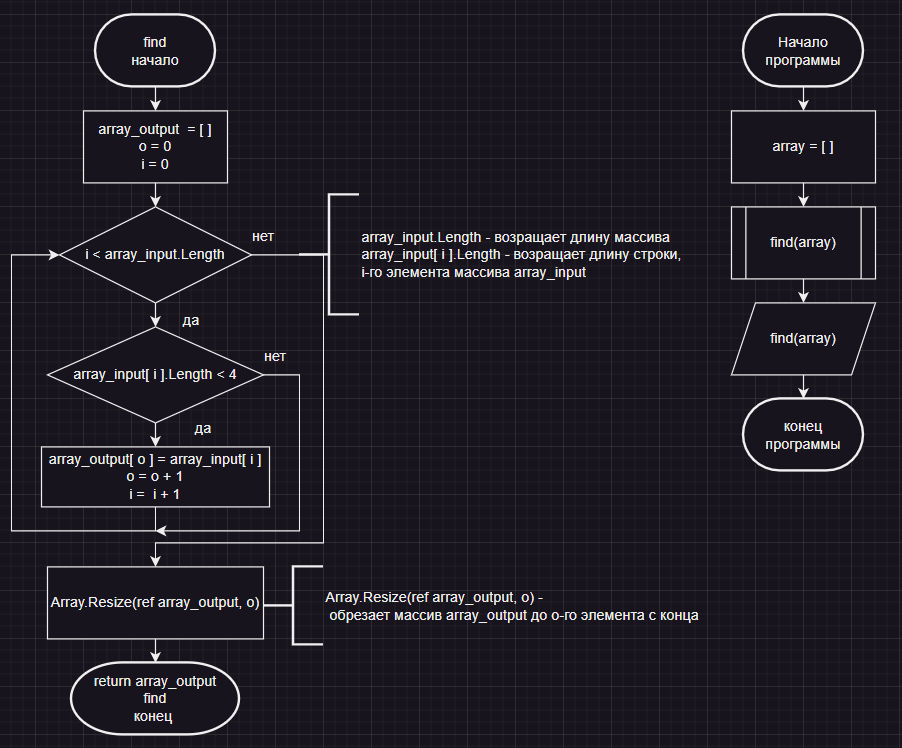

# Блок-схема программы

# Описание работы программы
## Метод find
На вход подаётся массив **array_input**, после создается массив **array_output** той же длины и переменная **o**. Затем в цикл **for** проходит и проверяет каждый элемент массива **array_input** на длину **(< 4)**. Если условие выполняется, то такие элементы массива записываются в массив **array_output** и к переменной **o** добавляется **1**. После прохода, функцией **Array.Resize** обрезается массив **array_output** до элемента **o**. После идет возварт массива из метода.